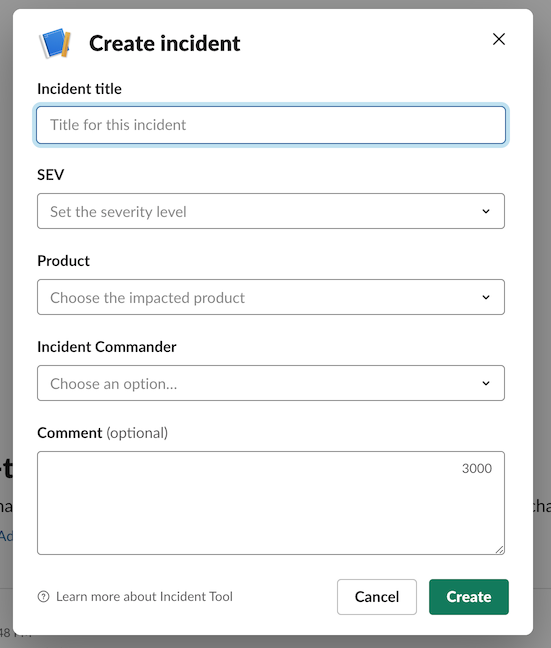
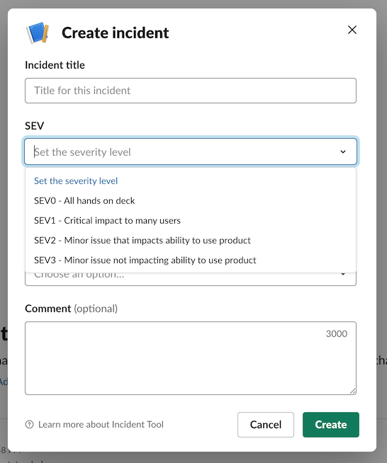
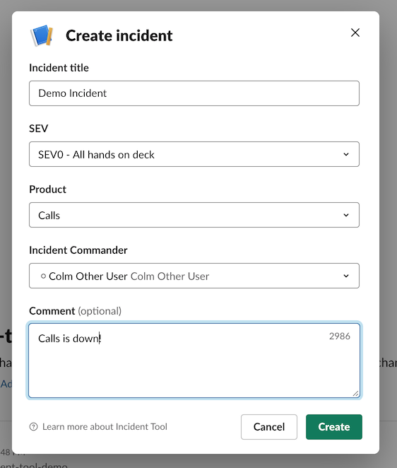
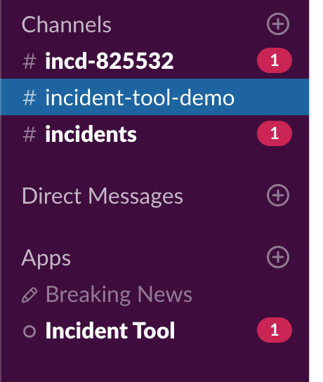
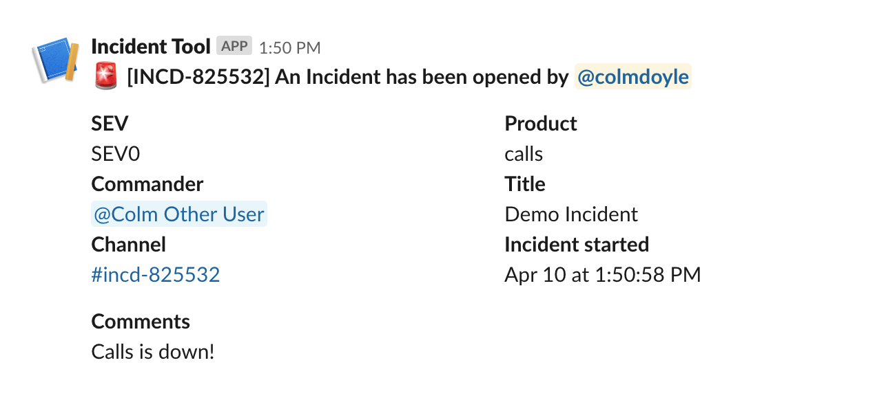
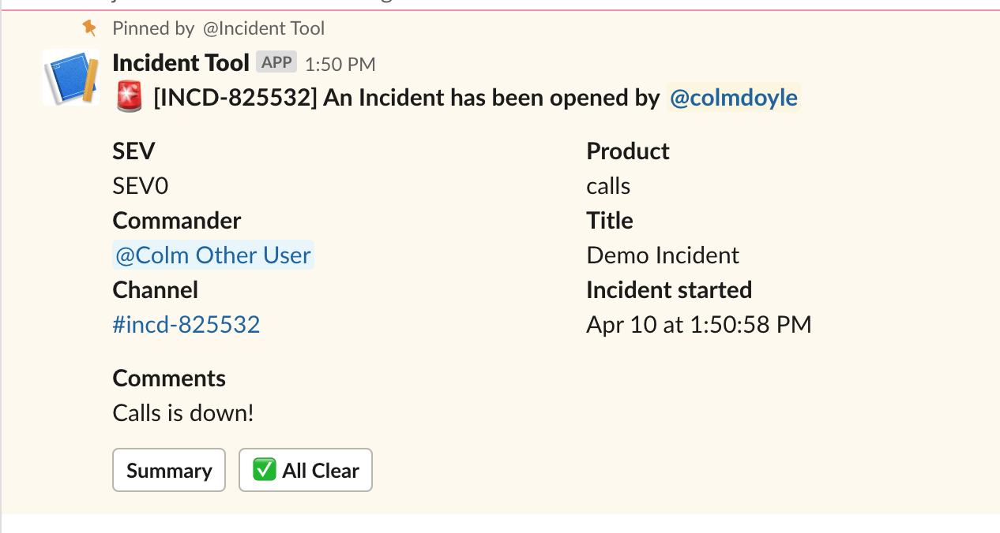

# Slack Incident Management Blueprint

An example of managing incidents via Slack

## Workflow

Incidents can be a busy and stressful time. You can alleviate some of this stress by automating it via your Slack workspace.

1. Users declare an incident using a `/incident` command in Slack
2. IncidentBot asks the user for some information about the incident, such as a title, description, product area, incident commander etc
3. IncidentBot takes this information and

- Creates a channel with the naming format of `#incd-1234`, where 1234 is a number identifying the incident and pins a post with the incident details
- Notifies the Incidents channel (see Environment variables used below)
- Notifies the product owners
- Notifies the incident commander

## Environment variables used

- `BOT_TOKEN` : The `xoxb` token for your app
- `USER_TOKEN` : The `xoxp` token for the installing user
- `BOT_USER_ID` : The User ID of your bot
- `INCIDENTS_CHANNEL` : A channel which recieves messages for all declared incidents
- `CLIENT_ID` : Provided via your App Dashboard
- `CLIENT_SECRET` : Provided via your App Dashboard

## Known limitations

This is really just a proof of concept, so some shortcuts have been taken for the sake of brevity

- Incident numbers are actually just a random integer. For a production deployment, we'd recommend using a unique number with some actual significance
- Nothing is persisted to a data store. For running historical analytics etc, it would probably be useful to log all incidents to a DB
- Product Owners are hardcoded into the tool. This would probably be better served via configuration

## Screenshots

### Initial Dialog

### Incident notifications

